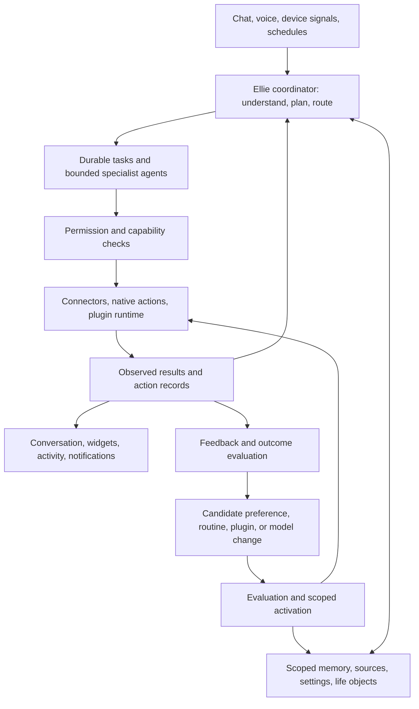

# Ellie: a harness for your life

Product planning draft · September 13, 2026

Ellie is a personal assistant that remembers your world, helps you anticipate what comes next, acts within your preferences, and builds new capabilities when you need them. Conversation is how you teach, use, and change her. The result can be a remembered preference, a completed errand, a recurring routine, a widget, or an entire small application.

The product promise is: **tell Ellie what matters, and she helps carry it forward.**

This plan proposes a personal-first product with shared spaces for households, partners, families, teams, and other groups. It preserves the project's local-first direction, replaceable models, and separation between personality and permission. It uses the supplied Every harness memo as architectural inspiration. Its back-office approval rules and product structure are not requirements for Ellie.

Everything below is proposed unless explicitly identified as implemented. The [delivery roadmap](roadmap.md) remains the record of current implementation and release gates.

**The experience**

Someone says, “My friend's birthday is next Saturday. They love gardening. Help me get something under $40.” Ellie links the person, occasion, interests, budget, deadline, and unfinished gift task. With the relevant sources connected, she can find options, watch a selected item for a discount, and surface the task when shopping becomes convenient. After the gift is bought, she stops the watch and removes the errand from the list.

The next useful step should survive the original conversation. The user should not have to recreate the context, manually connect several automations, or know which specialist agent to address.

**User correction, September 14:** preserve Ellie's existing widget/dashboard layout. The life harness belongs behind the existing boards, configurable widget grid and expanded app views. It must not introduce a replacement management interface organized around Today, Your world and Your space.

A floating, glowing orb at the bottom center is the primary control surface. It opens a focused conversation overlay above the dashboard; conversations are never dashboard widgets. Reminders, upcoming events, useful preparation, plans and generated apps appear as widgets automatically. Board selection, creation, naming, ordering and widget sizing remain familiar. Detailed memory, source, activity and preference controls are secondary inspection tools, tucked away until needed.

Every important operation should also work through conversation: “Why did you suggest that?”, “Only on weekends,” “Share this with the household,” “Stop watching that,” and “Undo the change.” Conversation is sufficient for ordinary use; the user should not need to organize content or configure a memory pipeline.

**Automatic conversation memory**

Every accepted user prompt creates an internal Markdown memory journal entry, including deterministic commands and interrupted model requests. The host derives entries from the authoritative stored conversation; it never treats assistant-generated claims as user facts. Existing retained conversations are processed automatically when this capability starts.

Ellie summarizes the retained statements, preferences, corrections and recent intentions into a bounded, cached Markdown context. The host injects this context into the system messages of later conversations in the same user and space. Capture, summarization, cache invalidation and file generation are internal implementation details. Users do not upload or maintain Markdown files to make Ellie remember.

The current implementation uses whole, extractive observations with explicit omission information. It carries ordinary facts and feedback without a “remember” command, preserves qualifications, separates historical requests from completed work, and excludes conversation-only style from lasting summaries. Richer semantic consolidation can improve this without changing the user experience. Current instructions and explicit settings outrank historical observations; memory cannot grant tools or replay old actions.

Corrections update later context. Forgetting suppresses matching automatic notes; deleting a conversation removes its derived notes and invalidates caches. Personal reset also removes generated Markdown. Shared-space conversations remain actor-private and are not copied into personal or other members' contexts. Original transcripts have their own visible deletion control.

**High-level feature families**

| Family                         | What Ellie should do                                                                                                                                  | Example                                                          |
| ------------------------------ | ----------------------------------------------------------------------------------------------------------------------------------------------------- | ---------------------------------------------------------------- |
| Memory and personal context    | Remember stated facts, preferences, decisions, unfinished intentions, and their sources; handle changes over time.                                    | “Remember that I prefer morning appointments.”                   |
| People and relationships       | Connect contacts, relationships, birthdays, gift interests, important dates, and chosen follow-ups.                                                   | “Help me stay in touch with my cousins.”                         |
| Time and commitments           | Manage reminders, timers, events, schedules, recurring obligations, holidays, travel buffers, and preparation.                                        | “Remind me to bring that form to my appointment.”                |
| Places and current context     | Use permissioned location, saved places, travel context, and explicitly available app or browser context.                                             | “When I'm near a hardware store, remind me about the filter.”    |
| Needs and recommendations      | Track purchases and replenishment, compare suitable options, watch prices, and suggest recipes or restaurants using preferences and current evidence. | “Find dinner ideas using what we already have.”                  |
| Plans and routines             | Turn an outcome into steps; coordinate recurring sequences and adapt future plans when circumstances change.                                          | “Make weekday mornings less rushed.”                             |
| Automations and watches        | Run on a schedule or a relevant change; monitor a condition until it is met, expires, or is cancelled.                                                | “Tell me when this goes below my budget.”                        |
| Knowledge and teaching         | Learn from documents, emails, transcripts, websites, PDFs, images, and other supported content.                                                       | “Use this handbook when helping our group plan events.”          |
| Creation and extensions        | Build widgets, games, dashboards, tools, integrations, and routines through Ellie's own plugin interface.                                             | “Build a standings widget and open today's games when I tap it.” |
| Background help and adaptation | Coordinate specialist work, retain progress, learn from corrections, improve extensions, and expose what changed.                                     | “Keep working on this, and make future updates shorter.”         |

These families should compose. Birthday planning combines people, time, preferences, shopping, location, reminders, and completion tracking. That composition is more valuable than shipping each feature as an isolated assistant.

**A shared model of the user's life**

Ellie needs durable objects that conversations and plugins can both use:

| Object                   | What it represents                                                                                                                       |
| ------------------------ | ---------------------------------------------------------------------------------------------------------------------------------------- |
| Person and group         | Identity, relationships, membership, and explicitly shared information.                                                                  |
| Place and context signal | A meaningful location or recent observation, including its timestamp, source, and uncertainty.                                           |
| Commitment               | An event, reminder, timer, birthday, holiday observance, deadline, or recurring obligation.                                              |
| Need and goal            | Something to acquire, resolve, maintain, or achieve, with constraints and completion criteria.                                           |
| Plan                     | Related steps, dependencies, owners, timing, and current progress toward an outcome.                                                     |
| Routine and automation   | A repeatable sequence and the schedule or event that activates it. A routine describes the work; an automation describes when to run it. |
| Memory and source        | A useful fact or preference, and the evidence or original content supporting it.                                                         |
| Extension                | A versioned capability with tools, views, storage, settings, and optional background work.                                               |
| Run and action record    | A particular attempt, its authorized actions, observed results, and unresolved work.                                                     |
| Feedback and change      | A correction, outcome, or proposed improvement linked to the behavior it concerns.                                                       |

Relationships connect these records: a person has a birthday; the birthday creates a gift need; a product satisfies that need; a store offers that product; an upcoming visit creates an opportunity. A “life graph” is a useful product model, without requiring a graph database as the first implementation.

An observed fact, an inference, an instruction, and an action result must remain distinguishable. “Usually shops on Sunday” should not silently become a calendar event. A current source can supersede an old inference; explicit corrections should take precedence over inferred preferences. Important contradictions remain visible rather than being silently merged.

Time deserves structured handling. Birthdays can lack a birth year; holidays depend on locale and chosen observance; recurring events can have exceptions; travel changes time zones. Timers need a reliable deadline and local alert path, not a model repeatedly deciding whether time is up. Missed reminders and expired opportunities need different recovery behavior.

**Default, group, and user settings**

For ordinary preferences, resolve **Ellie defaults → the active group's defaults → user overrides → an explicit task-specific choice**. Record where each effective setting came from so Ellie can answer “Why are you doing it this way?”

| Level   | Examples                                                                                             | Control                                                                      |
| ------- | ---------------------------------------------------------------------------------------------------- | ---------------------------------------------------------------------------- |
| Default | Personality, baseline notification behavior, retention defaults, starter capabilities.               | Versioned product defaults; installations can choose supported alternatives. |
| Group   | Shared calendar, household routines, common shopping list, shared knowledge, TV display preferences. | Authorized group members manage shared resources according to their roles.   |
| User    | Personal memory, private sources, voice, interests, quiet hours, preferred stores, private routines. | The individual controls their private space and participation in sharing.    |
| Task    | “Be brief for this update,” “Use this budget,” “Share this result with this group.”                  | Applies to this task unless the user makes it a lasting preference.          |

Permissions follow a separate rule: an operation must fit the user's authority, the resource's access rules, the plugin's granted capabilities, and device restrictions. A preference override cannot create permission. Group restrictions apply to group resources; being a group administrator does not automatically grant access to a member's private memories, location, or conversations.

A user may belong to multiple groups. Choose the relevant space for each task; do not combine unrelated group settings or retrieve all groups' data into one context. Sharing is explicit, and a derived summary cannot automatically have broader visibility than the private sources it reveals. Shared screens and guest sessions use their own restricted identities. Voice or tone recognition alone does not authenticate a person.

**Teaching Ellie through content**

“Train Ellie on this” should be a simple user experience backed by several distinct mechanisms:

| User intent                   | Mechanism                                                    | Result                                                                |
| ----------------------------- | ------------------------------------------------------------ | --------------------------------------------------------------------- |
| “Know what's in these files.” | Ingestion and retrieval.                                     | Searchable, cited knowledge that follows source access and freshness. |
| “Remember this about me.”     | Structured memory.                                           | A visible, editable fact or preference in the selected scope.         |
| “Follow this process.”        | Convert selected content into instructions or a routine.     | A versioned behavior the user can inspect and correct.                |
| “Learn how I like this done.” | Feedback-driven adaptation.                                  | Better response style, ranking, timing, or workflow defaults.         |
| “Improve the model itself.”   | A separate evaluation and training pipeline, when supported. | A tested model or adapter release rather than a memory write.         |

The ingestion path should preserve originals and source structure, extract text, perform OCR or visual interpretation for PNG/JPG and scanned PDFs, transcribe supported audio/video, and retain page, message, or timestamp references. Emails and HTML carry sender or page context; documents carry revisions; images retain the distinction between visible text and inferred scene meaning. Unsupported, unreadable, or ambiguous inputs produce an explicit partial result.

Extracted content becomes searchable knowledge first. When the user asks to adopt a policy or process, Ellie creates a readable set of proposed rules and example behaviors. Clearly authorized changes can apply directly with an undo path; ambiguity about scope or consequences calls for a focused question. Text inside an uploaded file cannot grant itself access, become a higher-priority instruction, or authorize external actions.

Knowledge, behavior instructions, and personal memory share provenance but have different lifecycles. Updated source content should refresh knowledge, mark dependent memories for reconsideration, and propose relevant routine changes without rewriting established behavior silently. Deleting a source removes its retained copies and indexes and invalidates or reviews derived records; explicitly retained user-authored rules stay distinguishable from source-derived material. Retrieval must enforce access before exposing content to a model or subagent.

Offer reusable **teaching collections** containing sources, preferences, routines, examples, and checks. A cooking collection could combine recipes, equipment instructions, dietary preferences, and shopping routines. Sharing a collection shares its selected configuration and allowed content; it does not carry the creator's private memories, credentials, or permissions.

Start with retrieval and explicit preferences. Changing model weights is unnecessary for remembering a birthday or adopting a handbook, and makes ordinary updates and deletion much harder.

**Anticipation as a complete feature**

Proactive help requires more than scheduled prompts. The loop should be:

**Notice a relevant change → connect it to an open need → check freshness and constraints → choose a useful next step → act or surface it at the right time → verify the outcome → close or update the need.**

| Situation             | What Ellie connects                                                                           | Useful behavior                                                                                                                                   |
| --------------------- | --------------------------------------------------------------------------------------------- | ------------------------------------------------------------------------------------------------------------------------------------------------- |
| Upcoming doctor visit | Calendar, travel buffer, requested forms, user-saved questions.                               | Prepare an administrative checklist and departure reminder. Appointment timing comes from the user or a source, not an invented medical schedule. |
| At a store            | Fresh location, open errands, budget, known availability.                                     | Surface one relevant errand when it is still actionable; avoid claiming precise shelf inventory without a supporting feed.                        |
| Shopping online       | Explicitly shared page or available browser integration, open purchase needs.                 | Show a relevant gift or deal in that context. Access to arbitrary activity in other apps is a separate integration dependency.                    |
| Price reduction       | A specific needed item, acceptable substitutes, delivered price, deadline.                    | Notify on a meaningful match; stop after purchase, cancellation, or expiry.                                                                       |
| Dinner planning       | Preferences, stated dietary constraints, recent meals, time, location, available ingredients. | Offer a few suitable options using current recipes or restaurant information. Distinguish hard constraints from inferred tastes.                  |
| Schedule change       | Changed event, dependent travel, reminders, and preparation tasks.                            | Recalculate the affected plan and update authorized reminders instead of duplicating them.                                                        |

Each suggestion should have a reason, expiration, confidence in its inputs, and a feedback path. Notification controls include quiet hours, urgency, per-category frequency, cooldowns, and a digest. Explicit timers and urgent requested reminders can notify immediately; ordinary discoveries can wait. Silence is a valid successful outcome when nothing useful changed.

Location and app context need an explicit device capability plan. Apple's region monitoring can support arrival/departure events, but delivery depends on platform and device state. A native phone companion or an equivalent authorized signal source is needed for dependable away-from-home context; the planned browser remote alone is not sufficient for that promise. Prefer selected places and recent context over retaining a continuous location history. [Apple region-monitoring documentation](https://developer.apple.com/documentation/corelocation/monitoring-the-user-s-proximity-to-geographic-regions)

**Ellie builds through her own extension system**

First-party and generated capabilities should use the same public, versioned extension interface, with privileged built-in adapters behind explicit grants. An extension is a durable capability that can combine:

- Tools with typed inputs, results, declared effects, and capability requirements.
- A compact widget, an expanded view, and a full-screen app where appropriate.
- Namespaced persistent data, migrations, and user/group settings.
- Connector-backed data sources and narrowly scoped credentials.
- Routines, event subscriptions, and bounded background jobs.
- Instructions, examples, outcome checks, version history, and repair information.

The creation loop is **request → short specification → assemble or generate → test in isolation → preview → activate within existing grants → observe → repair or revise → roll back if needed**. Reuse an installed capability when it already fits. A new grant is requested only when the concrete extension needs it. Editing colors or fixing a layout should not repeatedly require permission already granted for the same capability.

Generated UI and code execute in an isolated runtime. They request host services through a capability broker; they do not receive the host's full filesystem, credentials, or private memory. Rendering should use the smallest available data view. Dependencies and network access are explicit. A plugin can update itself through a candidate version, tests, and an atomic activation step; rollback must account for both code and stored-data migrations. Removing it also handles its watches, scheduled work, grants, and retained data.

Initially, “widget” means a widget inside Ellie's own clients. Native macOS/iOS home-screen widgets are separate platform surfaces and require their own delivery work.

The arcade example produces one extension with a high-score widget and a full-screen first-person arcade game. The widget and game use the same per-user score store. Activating Play opens the game; ending a game records a score and updates the widget. Acceptance includes playable controls, reliable exit from full screen, persistence after restart, score isolation between profiles, and a clear unsupported-device state. A shared leaderboard is an explicit scope choice. A local game needs no calendar, contacts, or internet permission.

The MLB example produces a standings widget, today's schedule, and an expanded game view. Standings and schedules should use a suitable MLB data adapter; Statcast is useful for deeper pitch and batted-ball analysis. MLB's Stats API standings and schedule endpoints returned structured data during this planning pass; that confirms technical feasibility for those reads, not a guaranteed commercial data service. Live-game coverage, provider terms, refresh limits, and failure handling still need validation when implementing the adapter. [MLB standings response](https://statsapi.mlb.com/api/v1/standings?leagueId=103,104&season=2026&standingsTypes=regularSeason), [MLB schedule response](https://statsapi.mlb.com/api/v1/schedule?sportId=1&date=2026-09-13), [Statcast field documentation](https://baseballsavant.mlb.com/csv-docs)

That extension needs favorite-team settings, time-zone-aware “today,” cache freshness, game-status handling, and a visible last-updated time. Test no games, doubleheaders, delays, postponements, stale data, and provider failure. Poll only as appropriate to the source and game state; fetching and rendering scores should not require an LLM on every refresh. If a dependency is unavailable, Ellie can finish a clearly labeled preview and identify the missing connection without presenting sample data as live.

**One execution system for chat, agents, and background work**

Keep the current deterministic fast path for well-defined actions. Add conversational interpretation and planning around it. Simple timers, scheduled triggers, feed refreshes, and known commands should run as ordinary software once configured. Use stronger reasoning for ambiguity, planning, research, and creation, with cloud processing available only within the installation's explicit data-disclosure choices.

Subagent orchestration belongs in the task model from the beginning. An individual subagent has a bounded objective, relevant context, an output contract, inherited permissions, a deadline, and a share of the parent's total budget. For a trip, agents might independently research travel, lodging, and activities. A parent combines their findings into one plan. The user talks to Ellie; specialist workers appear in activity when useful.

Subagent authority cannot exceed the parent's. Independent research can run concurrently; conflicting writes to the same calendar, list, or plugin require coordination and version checks. Findings reference shared records instead of creating divergent memory copies. Use delegation when work actually separates well, and keep a simple task with one executor.

Background process management needs durable queues, trigger subscriptions, checkpoints, bounded retries, deduplication, dependency tracking, progress, cancellation, concurrency limits, and outcome checks. Distinguish scheduled, queued, running, waiting for input, waiting for a device, completed, failed, cancelled, expired, and unknown outcomes. A process exiting successfully does not prove that a reservation was made or a widget displays the right data.

Watchers should sleep between events rather than keep an agent generating continuously. Per-user, group, task-tree, and plugin budgets bound cost, runtime, storage, and notification volume. Timers that must alert while the home coordinator is unavailable need device-local scheduling. Cloud or remote workers, if introduced, have explicit ownership and permissions; a sleeping Mac does not silently imply cloud failover.

Persist action identity and enough permitted checkpoint state to resume planning. Use downstream idempotency where available, and reconcile uncertain external results before retrying. There is no universal exactly-once guarantee for desktop or third-party actions. Cancellation stops remaining work when possible and reports any side effects already applied.

**Authority and records suited to personal life**

Adapt Every's read/stage/commit model into clear personal controls:

| Mode                           | Examples                                                                                 | Default behavior                                                                                                            |
| ------------------------------ | ---------------------------------------------------------------------------------------- | --------------------------------------------------------------------------------------------------------------------------- |
| Read and suggest               | Retrieve granted information, compare choices, prepare a checklist.                      | Proceed within existing source and device grants.                                                                           |
| Act within standing permission | Set a requested timer, update a private list, run an approved routine, refresh a widget. | Execute and report the result; provide undo where the operation supports it.                                                |
| Prepare and confirm            | Purchase a gift, send a message, share private content, make a consequential booking.    | Obtain the needed explicit authorization, which can be a sufficiently specific current request or a bounded standing grant. |

Standing grants are concrete: resource, action, scope, limits, duration, and revocation. An example is “Maintain my private packing checklist for this trip.” Broad trust or a model's confidence is not a substitute for the required grant. Additional authorization is needed when an action goes beyond what the user actually authorized.

Use an inspectable activity trail containing input references, settings and permission versions, meaningful steps, results, and changes. Show concise explanations of decisions, not raw hidden reasoning or a permanent copy of every sensitive model input.

The current repository deliberately stores payload-free job metadata and does not persist command text, prompts, responses, or memories. A resumable life assistant requires a deliberate new private-storage design: scoped access, explicit retention, encrypted content where required, export, deletion, and backup recovery. Keep personal content out of the public checkout and operational logs. Action metadata can be append-oriented while retained payloads remain separately deletable; forgetting must also cover derived indexes, cached summaries, and dependent jobs. Do not claim full transcript replay when the necessary content was never retained.

Sensitive personal information can be useful for this product when the user chooses to store it, including appointment details. That differs from Every's proposed exclusions. Give such content narrower visibility and control rather than assuming it should become shared household context.

**Learning and self-improvement**

Ellie should improve at several speeds, with an explicit boundary around what each loop can change:

| Loop                  | Signal                                                                | Permitted change                                                                       | Evidence before keeping it                                                                           |
| --------------------- | --------------------------------------------------------------------- | -------------------------------------------------------------------------------------- | ---------------------------------------------------------------------------------------------------- |
| Personal adaptation   | Direct correction, stated preference, example of a better response.   | User-scoped memory, tone, ranking, timing, or routine settings.                        | Confirm the understood change in plain language; show undo and verify future behavior.               |
| Extension improvement | Failed job, broken API response, user-reported defect, outcome check. | A new version of the affected plugin or routine within its grant.                      | Reproduce the issue, evaluate the candidate, check for regressions, activate with rollback.          |
| Harness improvement   | Repeated failure patterns and measured bottlenecks.                   | Candidate changes to orchestration, prompts, retrieval, routing, or core code.         | Separate regression and adversarial evaluation, controlled release, health checks, rollback.         |
| Model improvement     | Consented demonstrations, preferences, and outcome labels.            | Supported model fine-tuning, adapters, preference training, or reinforcement learning. | Held-out evaluation, comparison with the previous model, scoped rollout, quality and privacy review. |

Direct feedback such as “That reminder was useful, but too late” should become a specific, inspectable timing adjustment. “Be less chatty right now” is a session instruction unless the user makes it permanent. Personal feedback stays personal unless deliberately applied to a shared routine or offered to a broader improvement program.

Tone recognition can help Ellie choose a gentler, shorter, more serious, or more playful response. Treat inferred tone as temporary and uncertain. Sarcasm, frustration, or a quiet voice do not establish a lasting personal trait, medical fact, identity, or permission. Explicit user instructions override tone guesses.

Reinforcement learning is a later mechanism, not a prerequisite for the learning experience. First record reliable outcomes and explicit feedback and improve configurable behavior. Optimize for completed user goals, correctness, appropriately timed help, and reduced correction burden. Notification clicks, chat length, silence, and apparent emotional approval are weak signals and should not independently reward more interruption, flattery, or dependency.

Actual model training requires a trainable model/provider, appropriate infrastructure, enough suitable examples, a validated reward or preference signal, and a separate evaluation set. Default training data stays within its authorized scope. Cross-user training is a separate opt-in; removing a document from retrieval does not automatically remove its influence from trained weights, so training needs its own retention and deletion design.

Ellie can generate improvements to herself, including candidate core patches. Activation authority remains outside the generated change: she cannot rewrite permission enforcement, remove the evaluator, grant herself broader access, or treat her own claim of success as a passing test. Low-impact plugin repairs can eventually activate automatically within established rules; trusted-core releases need a separate release gate. This makes self-improvement an actual development loop with evidence and recovery.

**What to carry over from Every**

| Memo idea                        | Ellie adaptation                                                                                             |
| -------------------------------- | ------------------------------------------------------------------------------------------------------------ |
| Session log and receipts         | Keep durable task history and honest outcomes, with selective content retention and deletion.                |
| Job-shaped tools                 | Expose useful actions through a shared typed capability registry.                                            |
| Read, stage, commit              | Use standing permissions for everyday work and specific authorization for consequential actions.             |
| Inspectable memory               | Add individual/group scopes, temporal relationships, source access, and user-controlled sensitive content.   |
| Untrusted documents              | Separate knowledge extraction from authority; intentionally adopted instructions still remain within grants. |
| Background loops and quiet inbox | Add location, opportunity, preparation, and completion signals; respect the user's notification budget.      |
| Domain harnesses                 | Use specialist workers behind one Ellie conversation, with optional persistent projects.                     |
| Evals and feedback               | Measure real-life outcomes, privacy boundaries, timing, and regressions before widening automation.          |
| Curated tools                    | Extend the model with a sandboxed builder so people can create capabilities through chat.                    |

The borrowed value is reliable execution around a replaceable model. Ellie additionally needs personal context, useful timing, relationship-aware sharing, and a creation system ordinary users can operate.

**Build order and acceptance**

Prioritize a complete life workflow early. Keep the current hardware and service reliability gates; move conversational use, scoped memory, and an initial routine alongside the first useful authenticated client. A dashboard of fixtures remains a design aid, but the new product milestone should prove that a conversation carries an intention through to completion.

| Stage                          | Product slice                                                                                                                                                              | Exit evidence                                                                                                                                                                                               |
| ------------------------------ | -------------------------------------------------------------------------------------------------------------------------------------------------------------------------- | ----------------------------------------------------------------------------------------------------------------------------------------------------------------------------------------------------------- |
| 0. Reliable base               | Finish current service, sleep/wake, cancellation, client identity, and device-recovery work.                                                                               | Existing desktop commands work; failures and uncertain outcomes remain accurately reported.                                                                                                                 |
| 1. Remember and follow through | Text conversation; user/group identities and scoped records; contacts, birthdays, reminders, timers, calendar reading; Today and activity views; one preparation workflow. | A user teaches a preference and occasion, restarts Ellie, and gets the correct reminder; two synthetic users cannot retrieve each other's private data; duplicate delivery does not duplicate the reminder. |
| 2. Teach and automate          | Document/email/image ingestion, visible memory editing, selected content-to-routine conversion, deterministic schedules and watches, bounded agent tasks.                  | A changed source is reflected accurately; a routine survives restart and time-zone changes; revocation prevents future work; the background result is checked.                                              |
| 3. Build with Ellie            | Plugin runtime, widget and full-screen surfaces, SDK, isolated builder, versioning, budgets, repair and rollback.                                                          | The arcade and MLB requests create working extensions through the same interface used by built-in capabilities; missing data and permissions are visible; a bad update rolls back.                          |
| 4. Anticipate in context       | Native phone signals or equivalent integration, place reminders, app-context adapters, price watches, richer scheduling and recommendations.                               | A birthday shopping opportunity produces one timely suggestion and stops after completion; stale location and offline sources do not create false claims.                                                   |
| 5. Improve systematically      | Structured feedback, evaluations, candidate repairs, measured routing changes, optional training experiments, shareable extension/teaching collections.                    | A real failure produces a tested improvement without breaking unrelated tasks, expanding authority, or exposing another user's data.                                                                        |

Feedback capture and evaluation begin in stage 1. Scope isolation and a stable capability contract also start there. Later stages deepen those foundations; they do not retrofit them after private content and generated code already have access.

The first memorable acceptance story is **birthday → preparation → gift need → reminder → completed purchase recorded → watch stopped**. Start with time-based reminders and manually shared shopping context; add native location when that device capability is ready. The arcade and MLB stories then prove general extension building across both local interactive software and external live data.

This should extend the current repository rather than replace it:

- Keep the deterministic router, canonical operation registry, paired node execution, local permission checks, and personality boundary.
- Evolve the memory and knowledge interfaces into scoped stores and provenance-aware retrieval; their present contracts are placeholders.
- Add a durable task orchestrator above the existing job transport; the current payload-free job store is not a resumable agent session.
- Reuse independent compute workers for model placement. An inference worker is a machine capability; a subagent is a logical task, so the two should remain distinct.
- Introduce authenticated conversation/client surfaces and a plugin host incrementally. Preserve offline local actions and explicit cloud opt-in.

**How to tell whether it works**

Track verified task completion, missed or late commitments, duplicate actions, accepted and corrected memories, useful proactive suggestions, notification dismissals, and time spent correcting Ellie. For the builder, measure how often a request produces an actually usable extension and whether repairs preserve existing behavior. Track latency and cost per completed outcome, not just per model call.

Start with synthetic scenario checks for memory correction and deletion, private/group separation, recurrence and daylight-saving changes, expired grants, stale location, prompt injection through content, background recovery, uncertain action results, plugin isolation, and rollback. Compare learning candidates against held-out cases and the previous version. Keep product telemetry local by default and distinguish it from any separately consented shared training data.

For the initial scope, assume one person first, a household as the first group, a Mac coordinator, and optional phone/TV clients. Treat native mobile context, broader external connectors, marketplace distribution, and model-weight training as later increments. The architecture should leave room for them while the first release proves that Ellie remembers, follows through, and can be corrected entirely through conversation.
